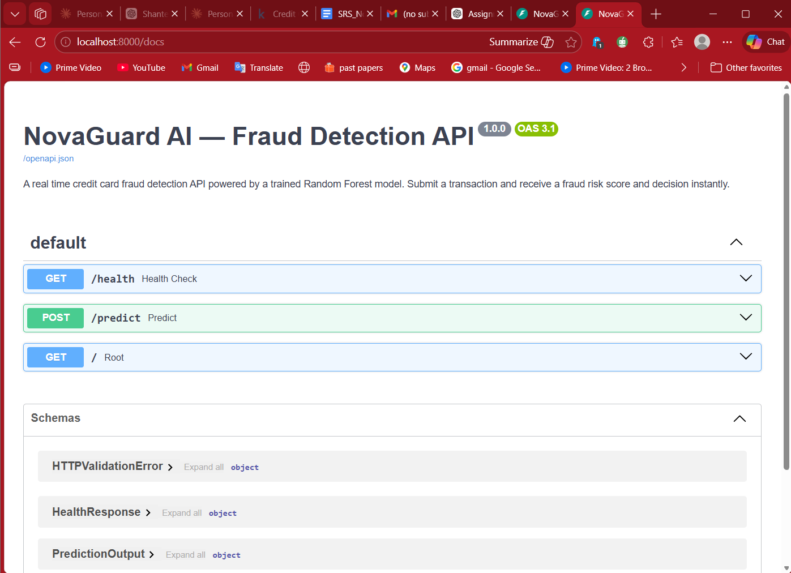
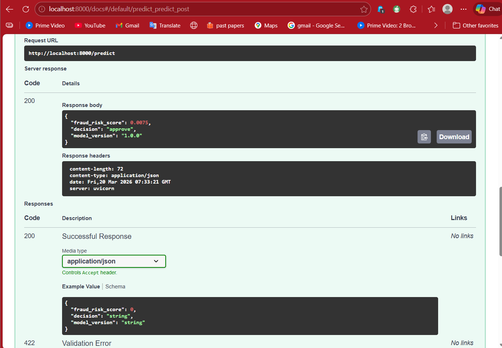
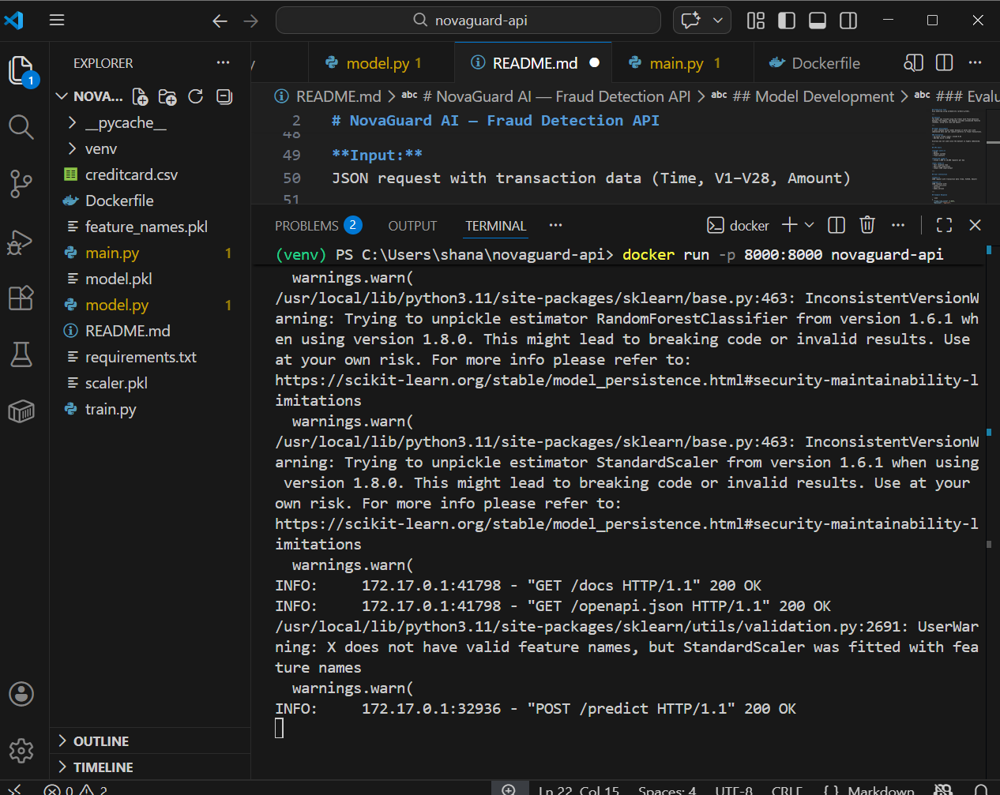

# NovaGuard AI — Fraud Detection API

## Overview
This project is a machine learning API that predicts whether a credit card transaction is fraudulent. It uses a Random Forest model and returns a fraud risk score along with a decision (approve, flag, or decline).

---

## Prediction Task
Risk modeling using probability (predict_proba).

---

## Dataset
The model was trained using the Credit Card Fraud Detection dataset from Kaggle. The dataset includes anonymized features (V1–V28), along with Time and Amount.

---

## Model Development
I used a Random Forest model because it works well with imbalanced data and can capture patterns in fraud transactions.

### Evaluation
- F1-score (fraud class): around 0.82  
- ROC-AUC Score: 0.9766  

Accuracy was not used since the dataset is highly imbalanced.

---

## API Users

**Target users:**
- Banks  
- Payment systems  
- Fraud analysts  

**Expected usage:**
- Around 1,000 to 10,000 requests per day  

**User needs:**
- Fast response time  
- Real-time predictions  
- Simple JSON input/output  

---

## User Interaction

**Input:**  
JSON request with transaction data (Time, V1–V28, Amount)

**Output:**  
JSON response with:
- fraud_risk_score  
- decision  
- model_version  

## Future Deployment:
This API can be deployed to Google Cloud Run or AWS Lambda using the Docker container.
---

## Example Response

```json
{
  "fraud_risk_score": 0.0075,
  "decision": "approve",
  "model_version": "1.0.0"
}
```
## Architecture Diagram


## Screenshots


### API Documentation (/docs)


### Prediction Example (/predict)


### Docker Running


## Live Demo

Run locally:
http://localhost:8000/docs
